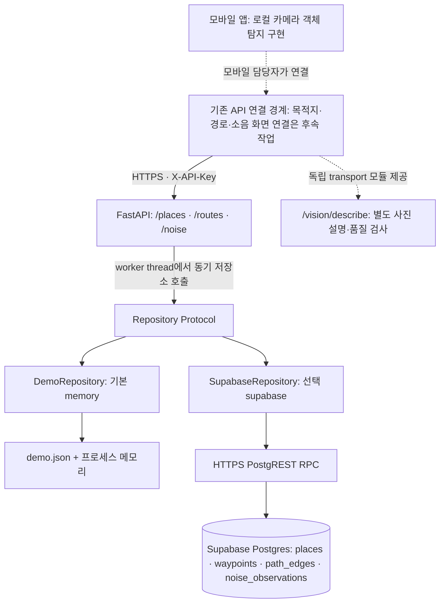

# SENSEA 데이터 연결 구조

이 문서는 루트 README 5번의 아키텍처를 현재 백엔드 구현과 연결합니다. API 요청·응답의 기준은 `backend/app/models.py`, `backend/app/main.py`와 `/docs`입니다. 루트 README의 경로 예시는 개요이며, 현재 데모 요청에는 `simulation: true`가 필요합니다.

작업 기준은 기존 백엔드와 모바일 카메라 구현이 포함된 `23809d5`입니다. 확인 당시 GitHub 기본 브랜치 `main`의 `6300a81`보다 9개 커밋 앞선 상태에서 별도 worktree를 사용했습니다. 공용 작업 폴더의 브랜치를 바꾸거나 `mobile/`와 모바일 빌드 워크플로를 수정하지 않았습니다.

## 현재 연결 상태



현재 `mobile/App.tsx`는 네이티브 카메라의 로컬 객체 탐지와 음성 출력을 사용합니다. 목적지·경로·소음 API 클라이언트는 아직 이 화면에 연결되지 않았습니다. `mobile/vision/createVisionTransport.mjs`에는 사진 전송 모듈이 있지만 현재 카메라 화면에서 사용하지 않습니다. 이번 변경은 기존 API 뒤의 저장소 연결 기반을 완성하며, 모바일 UI나 마이크 측정 기능은 포함하지 않습니다.

모바일에는 FastAPI의 주소와 앱 접근용 `SENSEA_API_KEY`만 전달합니다. Supabase URL이나 DB 비밀 키를 이용해 모바일이 DB에 직접 접근하는 경로는 없습니다. 앱에 포함되는 공유 접근 토큰은 운영용 사용자 인증을 대체하지 않습니다.

## 저장소 인터페이스와 실행 경계

`backend/app/repository.py`의 `Repository`는 다음 기능만 정의합니다.

- `search_places(query)`: 목적지 조회.
- `get_graph()`: 장소·waypoint·edge 그래프 조회.
- `noise_summaries(edge_ids, now)`: 여러 구간의 소음 요약 일괄 조회.
- `add_noise(observation)`: 동의를 확인한 소음 요약값 저장과 집계 반환.
- `simulation_only`와 `close()`: 데이터 모드 및 자원 정리.

FastAPI는 이 인터페이스를 사용하며, 동기 `httpx` DB 호출과 경로 계산을 worker thread에서 실행합니다. 네트워크 대기를 async 이벤트 루프에서 직접 수행하지 않습니다. 경로 계산은 그래프와 구간별 요약을 받은 뒤 기존 Dijkstra 알고리즘을 그대로 사용합니다. Supabase에서는 그래프를 하나의 RPC로, 필요한 모든 구간의 소음 요약을 별도의 하나의 RPC로 가져오므로 edge마다 DB를 호출하지 않습니다.

Supabase 호출에는 `SUPABASE_TIMEOUT_SECONDS`가 connect/read/write/pool 단계별로 적용됩니다. 이는 전체 SQL 실행 시간 제한을 보장하지 않으므로 운영 DB/PostgREST의 statement timeout도 별도로 설정·확인해야 합니다. 연결·HTTP 실패는 `503 storage_unavailable`, 잘못된 DB 응답은 `502 storage_invalid_response`, 시간 초과는 `504 storage_timeout`으로 기존 오류 봉투에 담아 반환합니다. Supabase 요청이 실패했다고 메모리 데이터로 바뀌지 않습니다. 저장 응답을 받지 못했을 때 이미 DB에서 commit되었을 수 있으므로 소음 업로드를 자동 재시도하지 않습니다.

## API별 데이터 흐름

### `GET /places?q=library`

API는 검색어의 앞뒤 공백을 제거하고 저장소에 전달합니다. 메모리는 가상 목적지 목록을 검색하고, Supabase는 `sensea_search_places(p_query)`로 `places`를 조회합니다. 대소문자를 구분하지 않는 문자열 포함 검색이며 `%`와 `_`를 검색 와일드카드로 취급하지 않습니다.

응답 형식은 `{ "simulation_only": true, "places": [...] }`를 유지합니다. 각 장소에는 `id`, `name`, `waypoint_id`, 좌표, `entrance_notes`, `verified_at`이 있습니다. 모바일은 장소 UUID를 경로 종점으로 보내지 않고 `waypoint_id`를 사용합니다. 메모리 예제 좌표는 `null`입니다.

### `POST /routes`

```json
{
  "start_waypoint": "start",
  "end_waypoint": "library_entrance",
  "noise_preference": "quiet",
  "simulation": true
}
```

API는 `Repository.get_graph()`로 그래프를 가져오고 `noise_summaries()`로 요약을 읽습니다. Supabase의 `sensea_graph()`는 같은 DB statement의 장소·waypoint·edge snapshot을 반환합니다. `sensea_noise_summaries(...)`는 그 그래프에 필요한 구간들을 한꺼번에 집계합니다. 두 RPC 전체가 하나의 트랜잭션인 것은 아닙니다.

경로 계산은 최단 경로와 소음 가중 경로를 비교하고 동일 경로는 한 번만 반환합니다. 응답은 `simulation_only`, `routes`, `explanation`이며, 각 경로에 `distance_m`, `relative_noise`, `noise_data_status`, `noise_coverage`, `segments`가 있습니다. 구간별 `noise`에는 평균, 상태, 최신 관측 시간, 표본 수가 포함됩니다.

`simulation_only=true`이면 요청의 `simulation=true`가 필수입니다. `simulation_only=false`이면 검증되지 않은 edge가 제외되며, 클라이언트가 `simulation=true`를 보냈다고 이 필터가 해제되지 않습니다. 양방향 경로는 역방향 안내 문장이 있어야 사용할 수 있습니다. 누락·만료된 소음은 0으로 간주하지 않고 비용에 보수적인 값 1을 사용합니다. 실제 경로 검증은 사람이 수행해야 합니다.

### `POST /noise`

```json
{
  "edge_id": "start-quad",
  "relative_noise": 0.3,
  "consent": true
}
```

기존 요청은 `[0,1]`의 상대 소음 요약과 JSON boolean 동의만 받습니다. `consent: "true"` 같은 문자열은 유효하지 않습니다. 동의가 없으면 400, 미등록 edge면 404이며 저장하지 않습니다. raw audio, 사용자 GPS, 사용자 ID, 원본 프레임은 받거나 저장하지 않습니다.

메모리는 기존 구간별 deque에 저장합니다. Supabase는 `sensea_add_noise(p_edge_id, p_relative_noise, p_ttl_seconds)`에서 서버 시간으로 `noise_observations`에 삽입한 뒤 같은 트랜잭션 안에서 해당 구간의 요약을 반환합니다. API 응답은 `{ "accepted": true, "simulation_only": true, "summary": {...} }` 형식을 유지합니다.

`relative_noise`는 상대값이며 인증된 dB SPL이나 인원수가 아닙니다. DB에는 구간 ID, 상대 소음값, 서버 관측 시각과 행 ID만 저장됩니다. 이 스키마는 사용자별 관측을 추적하지 않습니다.

### 저장소와 독립인 API

`GET /health`는 설정된 앱 상태를 반환합니다. `data_mode`는 시뮬레이션이면 `demo`, 그 외에는 `live`이고 `simulation_only`가 별도로 있습니다. `status=ok`는 DB 연결·권한·마이그레이션의 성공 또는 실제 보행 경로 검증을 의미하지 않습니다. DB 상태 확인은 아래 선택 검사를 따로 실행합니다.

`POST /vision/describe`는 기존 multipart·품질검사·응답 ID 계약을 유지하고 DB를 사용하지 않습니다. `POST /speech/transcribe`도 기존 `501 speech_not_configured`를 유지합니다. 사진 설명과 실시간 로컬 탐지는 경로 데이터 저장과 별도 기능입니다.

## 메모리와 Supabase 설정

두 모드 모두 `backend/`에서 실행합니다. `.env.example`을 로컬 `.env`로 복사해 사용하며, 실제 키는 `.env.example`, 코드, 문서, 로그, Git이나 채팅에 넣지 않습니다.

- `STORAGE_BACKEND=memory`: 기본값. 외부 계정 없이 기존 가상 그래프와 메모리 데모가 실행됩니다. 항상 `simulation_only=true`이고 재시작하면 업로드가 사라집니다. 단일 worker로 실행합니다.
- `STORAGE_BACKEND=supabase`: DB 어댑터를 선택합니다. `SUPABASE_URL`, `SUPABASE_SECRET_KEY`, 비어 있지 않은 `SENSEA_API_KEY`가 필수이며 누락 시 시작 설정 오류를 알립니다.
- `SUPABASE_URL`: 본인이 관리하는 프로젝트의 HTTPS 기본 URL. `/rest/v1`을 붙이지 않습니다. 로컬 Supabase 개발 시 HTTP는 localhost·127.0.0.1·::1의 loopback 주소에만 허용합니다.
- `SUPABASE_SECRET_KEY`: 서버 전용 `sb_secret_...` 키 또는 기존 `service_role` 키. 모바일에 배포하지 않습니다.
- `SUPABASE_TIMEOUT_SECONDS=10`: DB HTTP 호출 제한 설정.
- `SUPABASE_SIMULATION_ONLY=true`: Supabase에서도 기본적으로 시뮬레이션으로 표시합니다. 저장소 선택과 별도입니다. 실제 데이터 검증을 마친 관리자가 의도적으로 설정하기 전까지 false로 바꾸지 않습니다.
- `NOISE_TTL_SECONDS=3600`: 집계에서 사용할 관측의 유효 기간. 기존 허용 범위는 1~86400초입니다.
- `SENSEA_API_KEY`: FastAPI 앱 접근 토큰. Supabase의 높은 DB 권한으로 쓰는 API를 보호하기 위해 Supabase 모드에서 필수입니다. DB 키와 다른 값을 사용합니다.

설정 예시는 다음과 같습니다. 표시한 문자열은 실제 키가 아닙니다.

```dotenv
STORAGE_BACKEND=supabase
SUPABASE_URL=https://YOUR_PROJECT.supabase.co
SUPABASE_SECRET_KEY=sb_secret_REPLACE_LOCALLY
SUPABASE_TIMEOUT_SECONDS=10
SUPABASE_SIMULATION_ONLY=true
SENSEA_API_KEY=REPLACE_WITH_A_SEPARATE_APP_TOKEN
NOISE_TTL_SECONDS=3600
```

[Supabase API 키 문서](https://supabase.com/docs/guides/getting-started/api-keys)에 따라 secret 키는 서버에만 둡니다. 신규 secret 키는 `apikey` 헤더로 보내며 JWT로 취급하지 않습니다. 어댑터는 기존 JWT `service_role` 키도 지원합니다. RLS를 우회할 수 있는 키이므로 FastAPI 인증과 DB의 명시적 권한 제한을 함께 사용합니다.

Windows PowerShell:

```powershell
cd backend
python -m venv .venv
.\.venv\Scripts\python.exe -m pip install -r requirements-dev.txt
Copy-Item .env.example .env
# .env를 로컬 편집기에서 설정한 뒤 실행합니다.
.\.venv\Scripts\python.exe -m uvicorn app.main:app --host 127.0.0.1 --port 8000
```

macOS/Linux:

```bash
cd backend
python3 -m venv .venv
.venv/bin/python -m pip install -r requirements-dev.txt
cp .env.example .env
# .env를 로컬 편집기에서 설정한 뒤 실행합니다.
.venv/bin/python -m uvicorn app.main:app --host 127.0.0.1 --port 8000
```

이미 `.env`가 있다면 복사로 덮어쓰지 말고 필요한 변수만 추가합니다. 운영 셸·비밀 관리 시스템에서 제공한 환경변수가 로컬 `.env`보다 우선합니다. 사진 분석의 `VISION_PROVIDER`와 OpenAI 설정은 저장소 선택과 독립적입니다.

## 스키마와 마이그레이션 적용 순서

이 작업에서는 실제 Supabase 프로젝트에 SQL을 실행하지 않았습니다. 앱 시작이나 테스트도 자동 마이그레이션을 수행하지 않습니다. 대상 프로젝트와 기존 적용 이력을 확인한 담당자가 아래 파일의 SQL과 권한 영향을 검토한 뒤 개발 DB에 적용해야 합니다.

1. `backend/migrations/001_initial.sql`: 기존 파일은 수정하지 않습니다. 아직 적용하지 않은 새 대상에만 최초 한 번 적용합니다. 이미 적용했다면 재실행하지 않습니다. 루트 README의 짧은 스키마 예시만 적용된 DB는 `001`과 동일하지 않으므로 먼저 차이를 확인합니다.
2. `backend/migrations/002_storage.sql`: `001`이 적용된 DB에 적용합니다. 그래프·검색·일괄 집계·원자적 소음 저장 RPC, FK 조회 및 관측 시각 인덱스, 서버 역할 권한을 추가·정리합니다. 아래 권한 변경이 같은 DB의 다른 사용처에 미치는 영향도 확인합니다.
3. 적용 이력을 별도로 기록하고 읽기 전용 연결 검사 및 권한 검사를 수행합니다. [PostgREST 함수 문서](https://docs.postgrest.org/en/v12/references/api/functions.html)의 안내대로 schema cache 갱신을 확인합니다. 새 함수가 보이지 않으면 필요 시 `NOTIFY pgrst, 'reload schema';`를 실행합니다. 데이터가 없는 DB는 빈 결과를 반환할 수 있으며, 연결 성공이 가상/실제 경로 데이터가 준비됐다는 의미는 아닙니다.

`places.id`와 `noise_observations.id`는 UUID입니다. waypoint·edge ID는 text이고 `places.waypoint_id`, edge 양 끝, `noise_observations.edge_id`는 FK로 연결됩니다. edge는 서로 다른 두 waypoint, 양수이며 유한한 거리, 양방향 시 역방향 안내를 요구합니다. 기존 `noise_edge_time(edge_id, observed_at desc)` 인덱스를 유지합니다.

DB의 waypoint 좌표는 조회하더라도 현재 도메인 `Waypoint`에 직접 주입하지 않습니다. 어댑터가 필요한 필드를 명시적으로 매핑합니다. nullable `places.entrance_notes`는 API에서 빈 문자열로 매핑합니다. DB 반환 형식과 그래프 ID·참조를 확인해 잘못된 응답이 경로 계산의 임의 오류로 이어지지 않게 합니다.

RPC는 [Supabase database functions](https://supabase.com/docs/guides/database/functions) 방식으로 PostgREST에서 호출합니다. `002` 함수는 `security invoker`와 고정 `search_path`를 사용하며 테이블 이름에 `public` 스키마를 명시합니다. 함수 실행 권한은 `PUBLIC`, `anon`, `authenticated`에서 회수하고 `service_role`에만 부여합니다. 테이블 RLS와 클라이언트 접근 차단은 유지합니다. [RLS 문서](https://supabase.com/docs/guides/database/postgres/row-level-security)를 참고하세요.

`002`는 `001`의 광범위한 `service_role` 쓰기 권한을 줄입니다. 런타임은 그래프/관측 조회와 `noise_observations`의 지정 컬럼 삽입만 허용하며 update/delete 권한을 제거합니다. 관리자가 검증된 장소·경로 데이터를 입력하는 작업은 별도 관리 경로로 수행해야 합니다. 기존 행 삭제·테이블 초기화·자동 seed는 포함하지 않습니다. 실제 좌표나 보행 경로를 생성하지 않습니다.

## 소음 TTL과 데이터 보존

Supabase 집계는 현재 시각을 `now`라 할 때 `now - NOISE_TTL_SECONDS <= observed_at <= now`인 값 중 각 edge의 최신 최대 1,000개를 평균냅니다. 미래 timestamp는 집계하지 않습니다. 기존 메모리 저장소는 서버에서 현재 시각으로 생성한 관측을 구간별 최대 1,000개 보관하고 TTL보다 오래된 값을 제거합니다. 두 구현 모두 최신 관측 시각과 표본 수를 함께 반환하고, 유효 표본이 없으면 `relative_noise=null`, `latest_observed_at=null`, `sample_count=0`, `status=unknown`입니다.

메모리는 접근할 때 오래된 관측을 deque에서 제거합니다. Supabase에서는 TTL 밖의 행을 조회 집계에서 제외할 뿐, 런타임이 영구 저장된 행을 삭제하지 않습니다. 저장소가 Supabase여도 simulation 모드의 유효 요약은 `demo`로 표시하고, 실제 모드에서는 `measured`로 표시합니다. 이 표시는 데이터 모드이며 측정 기기의 보정이나 보행 안전을 보증하지 않습니다.

운영 시에는 별도로 정한 보존 기간에 맞는 정기 삭제 작업이 필요합니다. 이 작업은 아직 구성하거나 실행하지 않았습니다. 담당자는 대상 DB, 보존 기준, 삭제할 범위, 일정과 owner 또는 별도 유지보수 역할의 관리 권한을 검토한 뒤 별도 변경으로 준비해야 합니다. 런타임 `service_role`에는 삭제 권한이 없습니다. 현재 마이그레이션은 스케줄러를 생성하지 않습니다.

## 모바일 담당자 연결 사항

- 개발 기기에서는 FastAPI를 `--host 0.0.0.0`으로 실행하고 같은 네트워크의 PC 주소와 8000번 포트를 사용합니다. 휴대폰의 `localhost`는 PC가 아닙니다. 배포 주소는 HTTPS를 사용합니다.
- Supabase 모드와 토큰이 설정된 메모리 모드에서는 `X-API-Key`에 앱 접근 토큰을 보냅니다. Supabase 비밀 키나 OpenAI 키를 모바일 환경변수·번들·로그에 넣지 않습니다.
- `/places`에서 얻은 `waypoint_id`로 경로를 요청하고, 응답의 `simulation_only`를 확인합니다. 예제의 `start`, `library_entrance`, `start-quad`는 메모리 가상 데이터 ID입니다. 실제 DB에도 같은 ID가 있다고 가정하지 않습니다.
- simulation 표시, noise 상태·coverage·관측 시각, 빈 검색 결과, 알려지지 않은 지점과 DB 일시 오류를 처리해야 합니다. `data_mode=live`도 경로 검증·위치 정확도의 증거로 사용하지 않습니다.
- 오류 봉투는 `{ "error": { "code": "...", "message": "..." } }`입니다. 소음 업로드 실패 시 자동 재시도로 중복 관측을 만들지 않도록 합니다.
- 요청·응답 본문 형식은 기존과 동일합니다. 마이크 측정, 위치 처리, 목적지 화면, 보행 경로 검증, 운영 사용자 인증은 후속 작업입니다.

## 구현 및 검증 경계

이미 구현되어 있던 것은 가상 그래프, 메모리 소음 저장·TTL, 경로 알고리즘, 기존 FastAPI 계약, 사진 설명·품질 검사와 모바일 로컬 객체 탐지입니다. 이번 변경은 저장소 Protocol, 메모리 호환 경계, Supabase RPC 어댑터, 환경변수 선택, 오류·시간 제한 처리, 추가 마이그레이션, 계정 없이 실행하는 계약 테스트와 이 문서를 제공합니다.

기본 검사는 외부 Supabase 계정·네트워크·유료 API를 사용하지 않습니다. `backend/`에서 다음을 실행합니다.

```powershell
.\.venv\Scripts\python.exe -m pytest -q
.\.venv\Scripts\python.exe -m ruff check .
.\.venv\Scripts\python.exe -m ruff format --check .
```

macOS/Linux는 실행 파일을 `.venv/bin/python`으로 바꿉니다. mock 테스트는 저장소 선택, 필수 설정, 메모리 호환, Supabase 응답 매핑·오류와 no-fallback 동작을 검사합니다. 테스트 성공만으로 실제 DB 함수 실행, SQL 적용, RLS/권한, 공급자 연결이 검증되는 것은 아닙니다.

실제 프로젝트 URL·비밀 키를 로컬 환경에 설정하고 `001`→`002`를 검토·적용한 뒤에만 선택적으로 실행합니다.

```powershell
.\.venv\Scripts\python.exe -m app.check_storage
```

이 명령은 `STORAGE_BACKEND=supabase`를 요구하는 읽기 전용 검사입니다. 데이터 변경, 마이그레이션 적용, 소음 업로드를 수행하지 않습니다. 따라서 쓰기 트랜잭션과 물리 보존 정책은 별도의 실환경 검증이 남습니다.

실환경에서 남은 작업은 프로젝트·키 설정, SQL 적용 및 권한 확인, 검증된 경로 데이터 입력, 읽기·쓰기 확인, 보존 정책과 정기 정리 구성, 모바일 UI의 기존 API 연결입니다. 이 저장소 변경 자체로 실제 Supabase 연결·마이그레이션 적용·실제 보행 경로 검증이 완료된 것은 아닙니다.


### 이번 로컬 검사 기록

2026-09-26, Windows의 Python 3.14 가상환경에서 기존 38개 테스트를 포함한 전체 백엔드 테스트 133개와 Ruff lint/format, `git diff --check`가 통과했습니다. CI의 Python 3.12 환경은 이번 로컬 실행 대상이 아니었습니다. 기존 FastAPI/Starlette 테스트 클라이언트의 HTTPX 사용 중단 예정 경고가 1개 있으며 테스트 실패는 아닙니다.

추가로 [PGlite](https://pglite.dev/docs/)의 일회성 메모리 PostgreSQL에 원본 `001`과 새 `002`를 순서대로 실행하여 25개 검사를 통과했습니다. 이 검사는 가상 fixture만 사용하여 TTL 경계·미래 관측 제외·최신 1,000개 집계·삽입 직후 요약·FK 거부·서비스 역할의 쓰기 제한·anon/authenticated의 함수/테이블 접근 거부를 확인했습니다. 실제 Supabase 프로젝트, PostgREST 게이트웨이, 실제 키, 배포 DB의 적용 이력이나 권한을 검증한 결과는 아닙니다.

`app.check_storage`는 빈 그래프일 때 소음 RPC 호출을 생략하며 이 경우 `noise_rpc_checked=false`를 출력합니다. 읽기 성공 출력만으로 쓰기 함수까지 검증됐다고 판단하지 않습니다.
